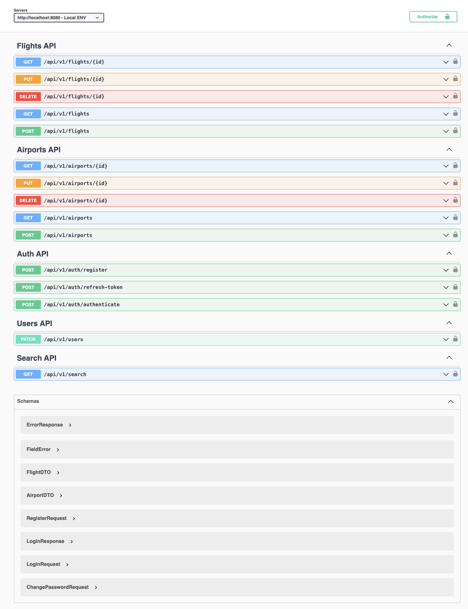

# Flight Search Api

## Technologies

- Spring Boot 3
- Gradle
- H2 Database
- Lombok
- Swagger
- JWT Authentication
- Spring Security
- Spring Data JPA

## Assumptions & Notes

- All endpoints need authentication. `POST`, `PUT`, `DELETE` methods can be used with `ADMIN` role only.
  - By default, there are two roles. `ADMIN` and `USER`. You can register new accounts with different roles to test the
    authentication.
- Unique id (`Long`) of airports used as `IATA` code.
- Folder structure is based on domain driven design.
- Unfortunately, tests are incomplete.
- There can be multiple airports in the same city.
- The scheduled task runs every 15 seconds to demonstrate the functionality. You can uncomment the `@Scheduled`
  annotation
  in `FlightTasks` to run it every midnight.
  - In each run, it will generate 1 to 10 flights and save them to the database.

## Development

(Optional) Update your local database connection in `application.yml` or create your own `application-local.yml` file to
override
settings for development.

After starting the application it is accessible under `localhost:8080`. And Swagger UI at `http://localhost:8080/swagger-ui.html`

## Build

The application can be built using the following command:

```
gradlew clean build
```

Start your application with the following command - here with the profile `production`:

```
java -Dspring.profiles.active=production -jar ./build/libs/api-0.0.1-SNAPSHOT.jar
```

If required, a Docker image can be created with the Spring Boot plugin. Add `SPRING_PROFILES_ACTIVE=production` as
environment variable when running the container.

```
gradlew bootBuildImage --imageName=com.amadeus/api
```

## API Preview


## Credits

https://github.com/ali-bouali/spring-boot-3-jwt-security/
